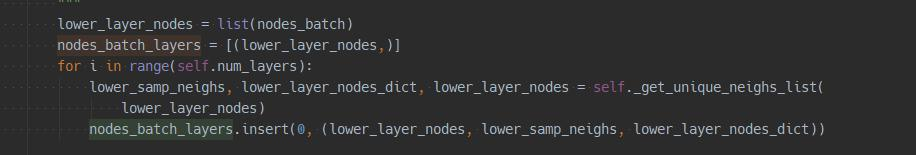
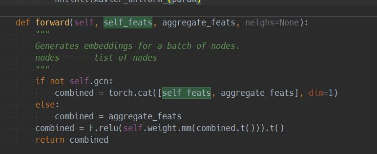
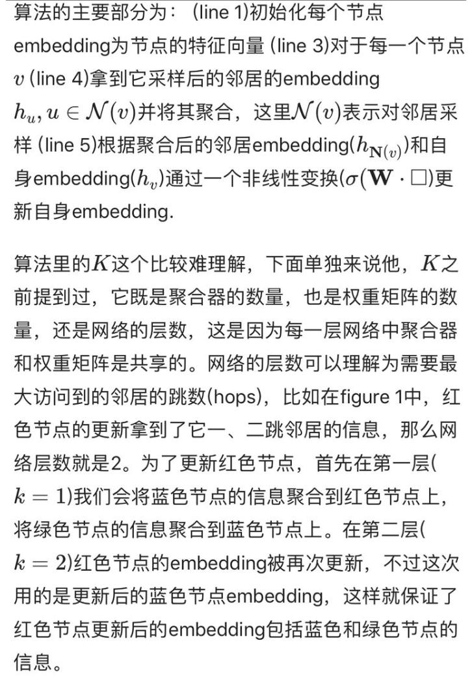
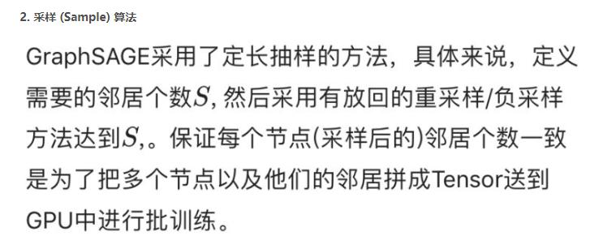
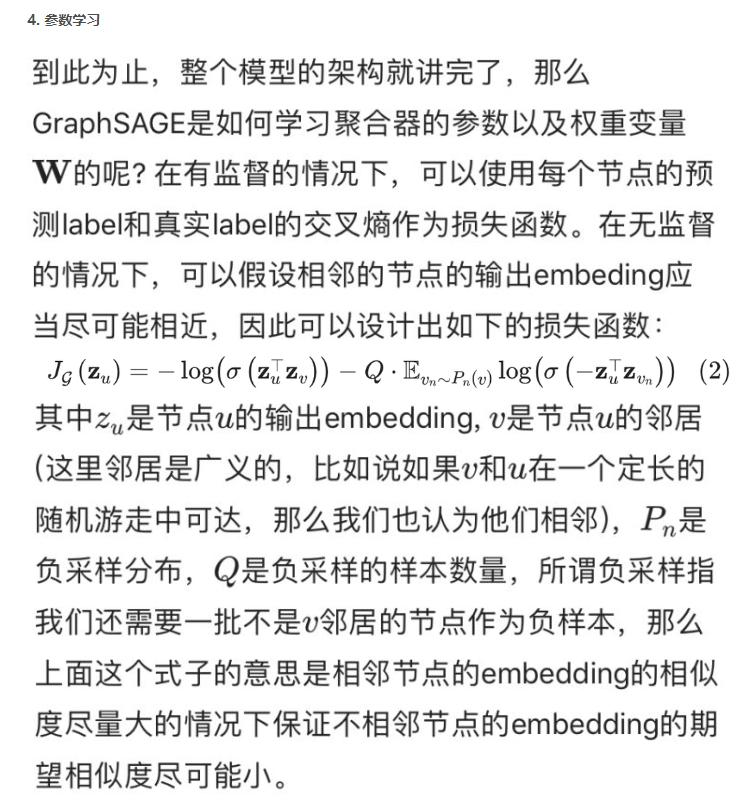

## GraphSage

### 数据结构：

* adj_lists：没有采用邻接矩阵的方式进行图卷积，邻居节点采用字典(set)方式进行存储

### GrapSAGE
1. 模型会先根据训练节点，找出N层之后的节点，通过最外层节点往里聚合。
	
	通过邻居节点上一层的嵌入表示聚合当前节点，并将聚合邻居节点得到的向量和当前节点的上一层的嵌入向量进行拼接，并通过全连接层转换。
	

2. 具体步骤如下：
	对训练节点，先对邻居进行随机采样，为了防止邻居节点过大，选择部分邻居节点进行学习。
	聚合是从外往里：先聚合2跳邻居特征，生成一跳邻居embedding，再聚合一跳邻居embedding，生成目标节点embedding，从而获得二跳邻居信息。
	将embedding作为全连接层的输入，预测目标节点的标签。

3. 不同的聚合函数
	平均：先对邻居embedding中每个维度取平均，然后与目标节点embedding拼接后进行非线性转换。
	GCN归纳式：直接对目标节点和所有邻居emebdding中每个维度取平均
	LSTM：先对邻居随机排序，然后将随机的邻居序列embedding作为LSTM输入
	pooling聚合器：先对每个邻居节点上一层embedding进行非线性转换，再按维度应用 max/mean pooling，捕获邻居集上在某方面的突出的／综合的表现 以此表示目标节点embedding。
	
4. 一种邻居特征聚集的方法：
	邻居采样(sample neighborhood)。因为每个节点的度是不一致的，为了计算高效， 为每个节点采样固定数量的邻居。
	邻居特征聚集(aggregate feature information from neighbors)。通过聚集采样到的邻居特征，更新当前节点的特征。网络第k层聚集到的 邻居即为BFS过程第k层的邻居
	训练。既可以用获得的embedding预测节点的上下文信息（context），也可以利用embedding做有监督训练。

	采样方法：
	在图中随机采样若干个结点，结点数为传统任务中的batch_size。对于每个结点，随机选择固定数目的邻居结点(receptive field)(这里邻居不一定是一阶邻居，也可以是二阶邻居)
	
	将邻居结点的信息通过计算采样结点处的损失。如果是无监督任务，我们希望图上邻居结点的编码相似(即计算各邻居节点的相似度)
	如果是监督任务，即可根据具体结点的任务标签计算损失

5. 训练相关:
	1.为了将算法1扩展到minibatch环境上，给定一组输入顶点，先采样采出需要的邻居集合（直到深度K），然后运行内部循环（算法1的第三行）。
	2.出于对计算效率的考虑，对每个顶点采样一定数量的邻居顶点作为待聚合信息的顶点。设需要的邻居数量，即采样数量为S，若顶点邻居数少于S,则采用有放回的抽样方法，直到采样出SSS个顶点。若顶点邻居数大于SSS，则采用无放回的抽样。(即采用有放回的重采样/负采样方法达到S)
	
	3.文中在较大的数据集上实验。因此，统一采样一个固定大小的邻域集，以保持每个batch的计算占用空间是固定的（即 graphSAGE并不是使用全部的相邻节点，而是做了固定size的采样）。
	4.这里需要注意的是，每一层的node的表示都是由上一层生成的，跟本层的其他节点无关，这也是一种基于层的采样方式。

6. 关于模型的理解
至于说为什么GCN是transductive，为啥要把所有节点放在一起训练？ 我感觉不一定要把所有节点放在一起训练，一个个节点放进去训练也是可以的。
无非是你如果想得到所有节点的embedding，那么GCN可以让你一口气把整个graph丢进去，直接得到embedding，还可以直接进行节点分类、边的预测等任务。

其实，通过GraphSAGE得到的节点的embedding，在增加了新的节点之后，旧的节点也需要更新，这个是无法避免的，因为，新增加点意味着环境变了，
那之前的节点的表示自然也应该有所调整。只不过，对于老节点，可能新增一个节点对其影响微乎其微，所以可以暂且使用原来的embedding，但如果新增了很多，
极大地改变的原有的graph结构，那么就只能全部更新一次了。从这个角度去想的话，似乎GraphSAGE也不是什么“神仙”方法，只不过生成新节点embedding的过程，
实施起来相比于GCN更加灵活方便了。我们学习到了各种的聚合函数之后，其实就不用去计算所有节点的embedding，而是我们需要去考察哪些节点，就现场去计算，
这种方法的迁移能力也很强，在一个graph上学得了节点的聚合方法，到另一个新的类似的graph上就可以直接使用了。
